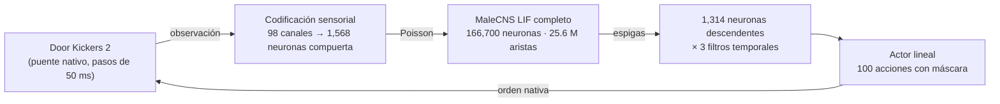

# Fly Operator Lab

**Un conectoma completo de mosca de la fruta controla a un operador de *Door Kickers 2*.**

Las **166,700 neuronas** clasificadas y las **25,582,938 conexiones** del conectoma *Drosophila* **MaleCNS v1.0** (Janelia FlyEM) se simulan como red LIF de espigas. La red recibe lo que el operador percibe en el juego y sus **1,314 neuronas descendentes** deciden qué hace.

La anatomía es fija y publicada. La dinámica, la interfaz sensorial, el catálogo de acciones y el aprendizaje son **adaptaciones de ingeniería** y se documentan como tales.

> Estado a 17-sep-2026:
> - **v3.2**, primera habilidad (`move`) resuelta con imitación: 100 % en validación.
> - **Aprendizaje autónomo aún no demostrado:** el adaptador PPO colapsó y la plasticidad interna no tuvo efecto medible.
> - **Siguiente paso:** [plan v4](docs/PLAN_MEJORA_V4.md), basado en los resultados y en [cómo lo hacen otros proyectos](docs/INVESTIGACION_REFERENCIAS.md).



## Qué hay aquí

| Carpeta | Contenido |
|---|---|
| [`native/`](native) | Puente C++ (MinHook) que avanza el juego por pasos, observa solo lo que ve el operador y ejecuta órdenes nativas |
| [`src/`](src) | Simulador LIF con plasticidad, entorno Gymnasium, codificación y lectura, política, currículo, checkpoints, guardia de recursos y API del panel |
| [`scripts/`](scripts) | Adquisición, preparación, validaciones, entrenamiento, sondas offline, informes y operación ([inventario](docs/SCRIPTS.md)) |
| [`dashboard/`](dashboard) | Observatorio web (React/Vite): flujo sensorimotor en vivo, matriz de conectividad, grafo por neurona, brújula de decisión |
| [`tests/`](tests) | 91 pruebas: equivalencia bit a bit, invariantes del protocolo, checkpoints, guardia de recursos, API |
| [`config/`](config) | Protocolo experimental (`learning.json`), pantalla (`runtime.json`), adaptador v1 |
| [`data/learning/`](data/learning) | Escenarios de laboratorio y esquemas sensoriales versionados |
| [`outputs/`](outputs) | Evidencia: validaciones, sondas, calibraciones e informes en JSON y Markdown |
| [`docs/`](docs) | Documentación |

## Documentación

- **[Arquitectura](docs/ARQUITECTURA.md):** componentes, flujo de un paso, cerebro, aprendizaje, checkpoints y panel.
- **[Resultados](docs/RESULTADOS.md):** v1 → v3.2 con cifras medidas, incluida la noche del 16–17 de septiembre.
- **[Operación](docs/OPERACION.md):** reproducir desde cero, entrenar una noche, recursos, panel remoto y problemas conocidos.
- **[Investigación de referencias](docs/INVESTIGACION_REFERENCIAS.md):** cómo entrenan cerebros de mosca NeuroMechFly, flybody, FlyGM, Eon, nfly, DOOMFLY y flyvis.
- **[Plan de mejora v4](docs/PLAN_MEJORA_V4.md):** PPO anclado, puerta por episodios, controles, acciones jerárquicas, aprendizaje por tipo celular y GPU.
- [Guía de aprendizaje v3.2](README_APRENDIZAJE.md) · [Prototipo v1 (histórico)](docs/PROTOTIPO_V1_V2.md) · [Informe v3.2](outputs/INFORME_APRENDIZAJE_V32.md) · [Terceros](THIRD_PARTY.md)

## Resultados clave

| Medida | Antes | Ahora |
|---|---|---|
| Tick con plasticidad (grafo real, equivalencia bit a bit) | 5.92 s | **0.44 s** |
| Decodificación DN → acción correcta (±45°), sonda offline | 78.8 % | **99.1 %** |
| Evaluación inicial de `move` tras la enseñanza (3 semillas) | 3/5 → 5/5 con reintento (semilla 7) | **5/5 al primer intento** |
| Validación de `move` en práctica: frozen, internal, combined (3 semillas) | — | **5/5 en cada una** |
| Adaptador PPO durante la noche (práctica, por cuartos) | — | **23/23 → 10 → 0 → 6** (colapso) |

## Inicio rápido

Requiere Door Kickers 2 v1.12 legítimo (Steam), Windows x64, Python 3.11, MSVC y Node.js. Pasos completos en [OPERACION.md](docs/OPERACION.md).

```powershell
python -m venv .venv-learning
.venv-learning\Scripts\python -m pip install -r requirements-learning.lock.txt
.venv-learning\Scripts\python scripts/acquire.py dataset
.venv-learning\Scripts\python scripts/acquire.py toolchain
.venv-learning\Scripts\python scripts/prepare_connectome.py
.venv-learning\Scripts\python scripts/setup_profile.py
.venv-learning\Scripts\python scripts/prepare_learning.py
powershell -File scripts/build_native.ps1
.venv-learning\Scripts\python -m pytest -q
# Entrenar 12 h y abrir http://127.0.0.1:8766
"INICIAR APRENDIZAJE.cmd"
```

## Advertencias

- Este repositorio **no incluye** Door Kickers 2, sus archivos, plantillas ni código descompilado. El puente solo funciona con el ejecutable cuyo hash está fijado, y usa un perfil aislado.
- El modelo no es una emulación fisiológica: MaleCNS aporta anatomía y predicciones de neurotransmisor. Constantes LIF, signos, puertos sensoriales y acciones son supuestos.
- Una misión ganada con instructor, o por la codificación sensorial, **no** demuestra aprendizaje autónomo; el protocolo separa enseñanza, práctica y validación reservada.
- Atribuciones y licencias de terceros: [THIRD_PARTY.md](THIRD_PARTY.md).
