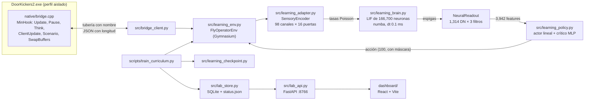

# Arquitectura

Fly Operator conecta el conectoma completo de *Drosophila* **MaleCNS v1.0** (166,700 neuronas clasificadas, 25,582,938 conexiones dirigidas) con un operador de **Door Kickers 2**. La anatomía es fija; la dinámica LIF, la interfaz sensorial, las acciones y el aprendizaje son adaptaciones de ingeniería documentadas como tales.

## 1. Puente nativo — `native/`

- **`bridge.cpp`:** DLL inyectada al arrancar el juego suspendido (`scripts/launch.py`).
  - **Verificación:** antes de instalar ganchos comprueba el SHA-256 del ejecutable (`EXPECTED_SHA256` en `build_profile.h`).
  - **Ganchos (MinHook):**
    - `GameServer::Update`: avanza el juego solo cuando llega un `step` y espera la visibilidad antes de observar.
    - `IsGamePaused`: el juego queda en pausa entre pasos, por eso se ve "Planning Mode".
    - `BrainPlayer::Think`: bloquea la IA automática del operador.
    - `GameClient::Update`: carga misiones y cierra la interfaz de despliegue.
    - `Scenario Evaluate`: resultado de la misión.
    - `SwapBuffers`: limita a 20 fps y hace capturas opcionales.
  - **Protocolo:** tubería `\\.\pipe\FlyOperator_<pid>`, solo clientes locales. Operaciones: `observe`, `start`, `step`, `load_mission`, `deploy`, `end`.
  - **Observación:** operador, humanos visibles (solo los que ve el operador), inventario, puertas y objetos relevantes, recibo de acción y tiempo del motor.
- **`learning_bridge.h`:** acciones de aprendizaje (equipar, puertas, brecha, granadas, usar/desactivar, seguir, agacharse, loadout) y recibos (`accepted`, `in_progress`, `completed`, `rejected`, `failed`).
- **`build_profile.h`:** RVAs derivados del PDB del juego. Los genera `scripts/native_profile.py` a partir de símbolos extraídos con Ghidra (`scripts/inspect_binary.py`). Un cambio de versión del juego exige repetir ese análisis.

## 2. Cliente y entorno

- **`src/bridge_client.py`:**
  - Transporte JSON con longitud.
  - `new_mission()` espera la línea `Loading UI took` del log de la sesión antes de recargar mapas; pedir `RestartMap` durante la carga inicial hace crashear el juego.
- **`src/learning_env.py`: `FlyOperatorEnv`** (Gymnasium).
  - `reset()` carga una misión de laboratorio de `data/learning/scenarios.json` y reinicia la actividad neuronal (no las ganancias aprendidas). `step()` ejecuta un paso de 50 ms en el juego e integra 50 ms de cerebro.
  - Recompensa: éxito − fracaso − 0.001 por tick + *shaping* potencial γφ' − φ.
  - Cortes: `no_progress` (32 decisiones sin mejorar distancia) y `policy_collapse` (48 esperas libres).
  - Diferencia **ticks mecánicos** (orden nativa en curso: solo `wait`, más `stop` o `cancel` en contexto) de **decisiones cognitivas**.
  - `ExerciseTeacher`: instructor programado por habilidad, sin información oculta; se usa solo para enseñanza.

## 3. Interfaz sensorial y acciones — `src/learning_adapter.py`

- **`SensoryEncoder`:** 98 canales semánticos (enemigos 16 sectores; amigos, rehenes, civiles, puertas, objetivo y paredes 8 cada uno; estado propio y tarea). Cada canal usa 16 neuronas compuerta excitatorias únicas, en total 1,568 puertos. La tasa es `5 Hz + ganancia · valor`.
  - Esquema en `data/learning/sensory_ports_v32.json`, generado por `scripts/build_sensory_schema_v32.py`:
    - las compuertas con rutas anatómicas más fuertes hacia las DN van a objetivo y estado dinámico;
    - afinación von Mises por sector;
    - proximidad al objetivo;
    - ganancia baja para estados casi constantes.
- **`NeuralReadout`:** tasas de las 1,314 neuronas descendentes filtradas a 100, 500 y 2,000 ms, log y z-score poblacional → 3,942 features.
- **`ActionCatalog`:** 100 acciones discretas (esperar, detener, cancelar, recargar, disparar, equipar, agacharse, 8 movimientos, 16 giros, apuntar, puertas, brechas, lanzamientos, desactivar, seguir, loadout). La máscara mecánica depende del estado del motor y del currículo.

## 4. Cerebro — `src/learning_brain.py`

- **LIF estilo Shiu:** τm = 20 ms, τs = 5 ms, reposo −52 mV, umbral −45 mV, retardo 1.8 ms, refractario 2.2 ms. Peso = sinapsis × 0.275 mV × signo del neurotransmisor predicho: GABA, glutamato e histamina inhibitorios; el resto excitatorio. Integración exacta, propagación por eventos (anillo de retardo) y numba en CPU.
- **Plasticidad:**
  - STDP con trazas y elegibilidad por arista (τ 2 s). Desde v3.2 solo se rastrea en aristas que entran a las DN (`set_plastic_posts`), con resultados idénticos bit a bit al rastreo completo.
  - `reward_motor(..., sign_aware=True)` es la regla `causal_motor_rstdp_v2`: crédito = gradiente de log π respecto a cada DN, con el signo presináptico respetado.
  - Límites de ganancia [0.25, 4]; la anatomía no cambia.
- **Checkpoints:** npz atómicos con voltajes, cola de retardo, trazas, elegibilidad, ganancias y RNG.
- **`src/flybrain.py`:** simulador del prototipo v1, sin aprendizaje.

## 5. Política y aprendizaje

- **`src/learning_policy.py`:**
  - `make_model`: MaskablePPO con actor lineal (`pi=[]`) y crítico MLP 64-64.
  - `imitate`: clonación de las demostraciones; la variante v3.2 existe pero está desactivada tras la evaluación offline.
  - `internal_update`: actualiza crítico y plasticidad; el actor queda fijo.
  - `decision`: contribuciones exactas al logit.
- **`src/learning_curriculum.py`:** `train_adapter_episode` (PPO con descuento γ^k por macroacción), `add_demonstration`, evaluación transaccional.
- **`scripts/train_curriculum.py`** (currículo v3):
  1. **Enseñanza común por semilla:** 6 episodios guiados + 6 DAgger, más un bootstrap de 5 episodios de validación (≥ 80 %).
  2. **Rondas por condición × semilla:**
     - `frozen`: nada aprende.
     - `adapter`: PPO.
     - `internal`: plasticidad + crítico.
     - `combined`: alterna adapter e internal.
  3. **Evaluación de promoción** cada 512 decisiones cognitivas. La etapa avanza cuando adapter, internal y combined logran ≥ 80 % en las 3 semillas (7, 19, 43).
  4. **Retención:** uno de cada 4 episodios repite una etapa anterior.
  - Etapas: move, stance, cancel, orient, switch, shoot, reload, door, breach, grenade, elimination, rescue, defuse, loadout.

## 6. Checkpoints y trazabilidad — `src/learning_checkpoint.py`

- Dos generaciones por nombre (`<condición>_<semilla>/0|1`) con `brain.npz`, `policy.pt`, `examples.npz` y `manifest.json`, todos con SHA-256.
- **Hash semántico:** cubre protocolo, recompensa, currículo, escenarios, capacidades, catálogo, acciones, esquema sensorial y dinámica. Cualquier cambio científico invalida los checkpoints y exige campaña nueva. Los límites operativos (RAM, CPU, pantalla) no entran en el hash.
- Nunca se publica un checkpoint con `NaN` o infinitos.

## 7. Operación — `src/learning_runtime.py`, `scripts/start_learning.ps1`, `scripts/supervise_learning.ps1`

- **`ResourceGuard`:**
  - pausa por RAM con histéresis (umbrales releídos cada 10 s de `config/learning.json`), disco o cuota, y guarda antes de pausar;
  - aplica afinidad de CPU y prioridad;
  - plazo del piloto persistente en `schedule.json`.
- **Supervisor:** relanza el entrenador si termina sin un paro intencional antes del plazo, y conserva los logs del fallo.
- **`LiveState`:** memmaps de voltajes, espigas y ganancias en vivo para el panel.

## 8. Registro y panel

- **`src/lab_store.py`:** SQLite (`steps`, `episodes`, `controls`, `checkpoints`), `latest.json` y `status.json`, escritos de forma atómica. Las validaciones se publican como transacción.
- **`src/lab_api.py`** (FastAPI en `127.0.0.1:8766`):
  - `/api/state`, `/api/history`, `/api/neuron/{id}` y `/api/neuron/{id}/graph`;
  - `/api/circuit/structure` (matriz de 8 familias sobre las 25.6 M aristas, en caché) y `/api/circuit/live`;
  - exportaciones;
  - `POST /api/control/{pause|resume|stop|probe}`, solo desde el host local.
- **`dashboard/`** (React + Vite):
  - pestañas Circuito (flujo sensorimotor en vivo, matriz de conectividad), Percepción, Actividad, Conectividad (grafo navegable por neurona), Aprendizaje y Decisión (brújula de movimiento);
  - utilidades gráficas en `dashboard/src/viz.jsx`, con paleta validada para daltonismo.

## 9. Herramientas offline

- **`src/offline_replay.py` + `scripts/probe_decodability.py`:** repiten episodios grabados con cualquier esquema sensorial y miden decodificabilidad con CV agrupada.
- **`scripts/validate_motor_cone_equivalence.py`:** equivalencia bit a bit del rastreo restringido.
- **`scripts/calibrate_motor_plasticity.py`** y **`scripts/evaluate_imitation_offline.py`:** calibraciones pareadas.

El inventario completo de scripts está en [SCRIPTS.md](SCRIPTS.md).
